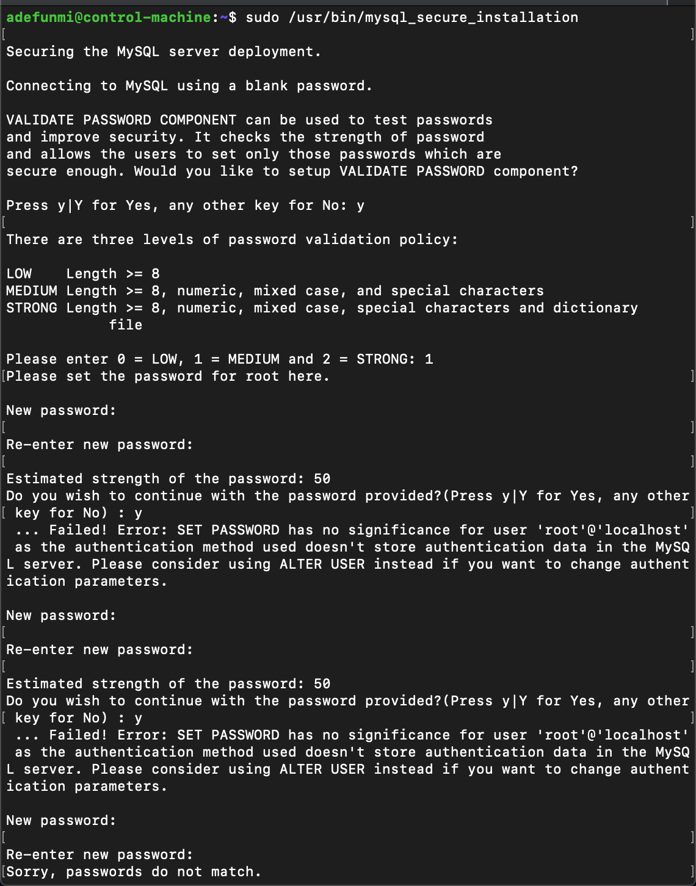
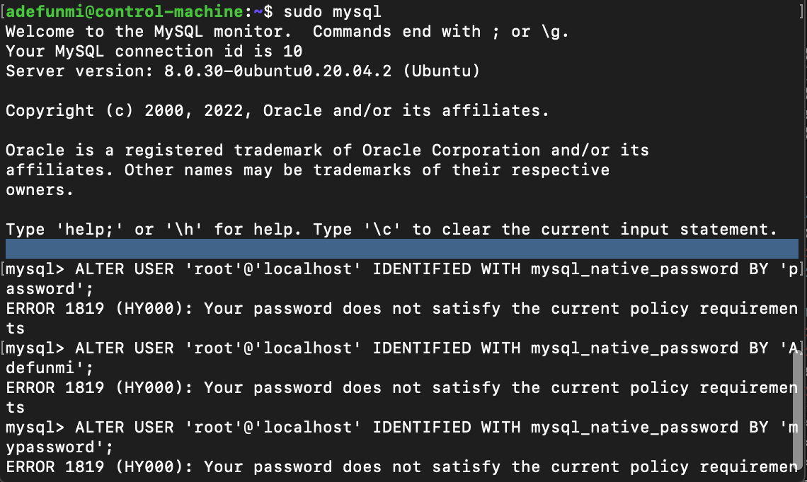
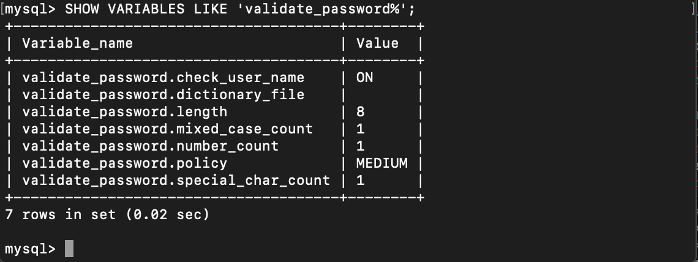
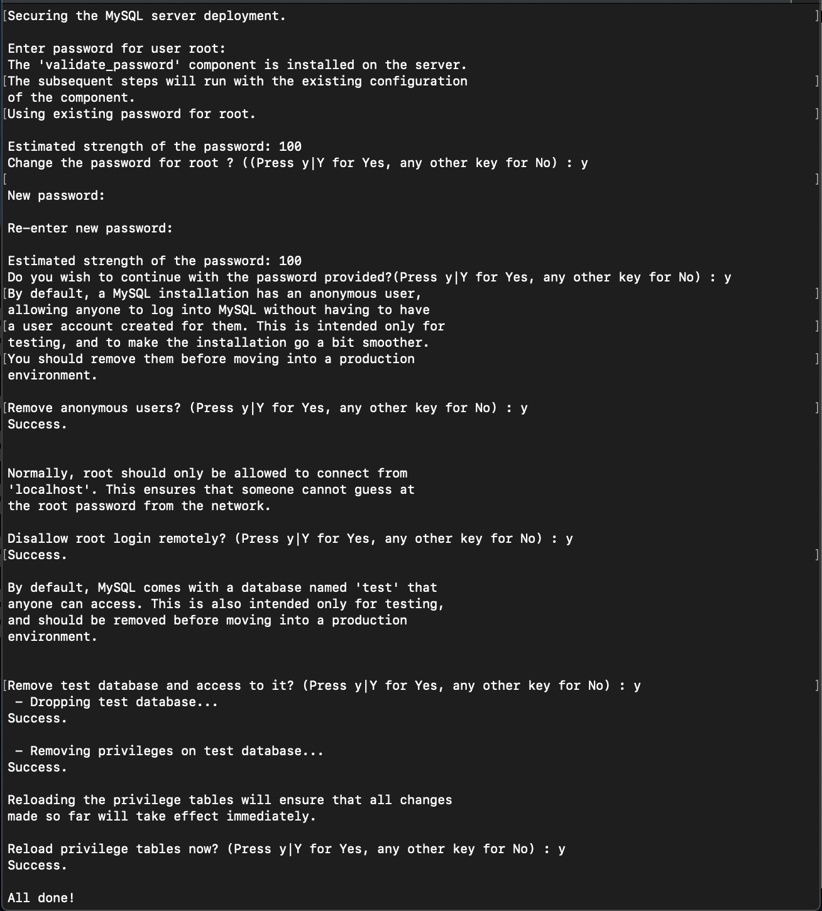
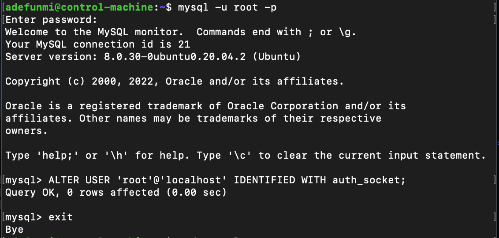

# How to solve the (... Failed! Error: SET PASSWORD...) error in MySQL Configuration

Have you tried to install MySQL and on getting to the security configuration stage, where you used the command `sudo /usr/bin/mysql_secure_installation` you got into a loop asking for password like I got myself into? In this article I will tell you how I was able to resolve the issue.

Without wasting any of your time, let's move right into it.

##How to resolve the error

Firstly, the only way you can get out of the loop is by discarding that terminal. This is because the script had been set to run its course before it exits and part of the things you are expected to do is to set a password for the root user. However, Ubuntu did not make provision for this user to connect by password. This is what the error loop looks like:



To solve this, you would make some changes from the mysql terminal before you go ahead to run the security installation script. 

### Working in the MySQL terminal
1. From your bash terminal, enter the MySQL terminal by typing the command `sudo mysql`.
<br>

2. Copy and paste this line of code below into the terminal to change the root user's authentication method to the one that makes use of password.

```
ALTER USER 'root'@'localhost' IDENTIFIED WITH mysql_native_password BY 'password';
```
Note that you will change the password to a valid MySQL password. If you don't use a valid one, you will continually run into errors as shown below:


<br>

3. Due to security measures, MySQL would not allow invalid passwords to be used in setting up the server, so, to set up a new one, you can check for the current password policy level set up on the system with the command:

```
SHOW VARIABLES LIKE 'validate_password%';
```

And you will get an output like this:


According to our MySQL security script, there are three policy levels:
a. LOW Length >= 8 characters.
b. MEDIUM Length >= 8, numeric, mixed case, and special characters.
c. STRONG Length >= 8, numeric, mixed case, special characters and dictionary file.

And since our password policy is set to medium, we will use a password with medium policy attached e.g. `Grandma$12345`, `antMan123$`, etc. There are however, ways to change your validation policies to high or low.
<br>

4. Exit the MySQL terminal into the bash terminal by using the `exit` command.
<br>

5. At the bash terminal, type in the following command to run the script again.
```
sudo /usr/bin/mysql_secure_installation
```
This command will take you series of prompts that you would give answers to based on your security preferences. Below is the output of the settings I did on my machine.


<br>

6. Once you complete setting up the script as shown in step 5 above, you need to reopen the MySQL terminal to return the root user's authentication to the default mode. This can be done by using the following commands:

```
mysql -u root -p

ALTER USER 'root'@'localhost' IDENTIFIED WITH auth_socket;

exit
```

You should note that the`mysql -u root -p` will request for a password, this will be the password you used in the security script in step 5 above.



At this point (when you exit the MySQL terminal into bash shell), you can use the default `sudo mysql` command once again.

## Conclusion

I hope this steps have helped you to finally resolve the error you were facing in order to set up your MuSQL server. As you've seen, the solution highlighted what to do prior running the security script, how to run the script, and how to return it to the default setting. 

When you return to the default setting that allows you to use the `sudo mysql` command, it may raise some security concerns, however, it makes the server more secure because random persons cannot log into the server. Only users with sudo privileges can gain access into it that way. 

With these steps in place, you can move past the hurdle and onto the other configurations on the server.


