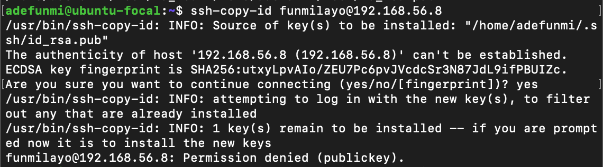
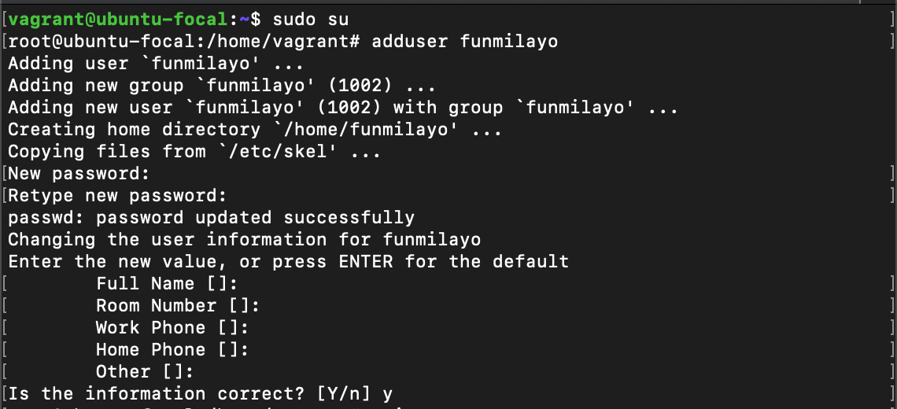
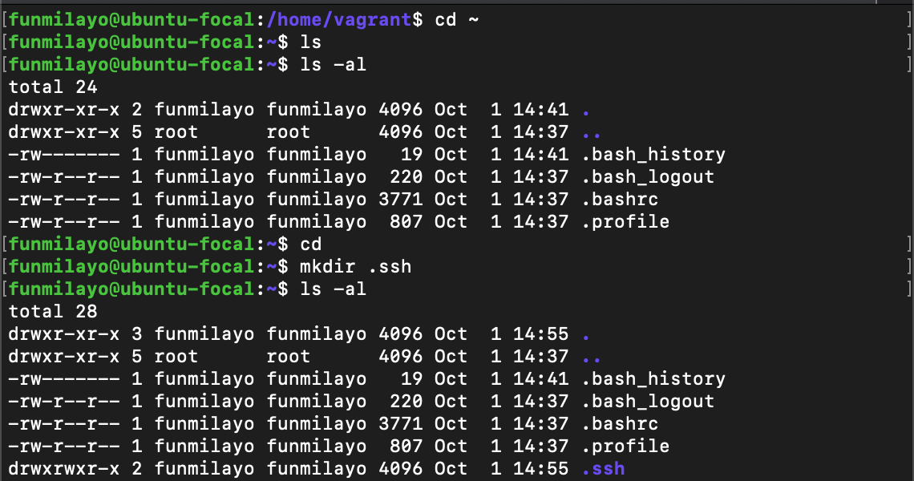
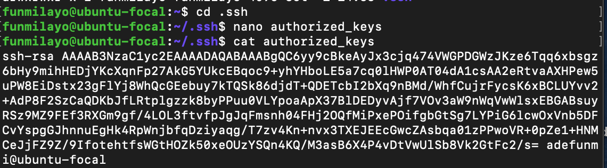
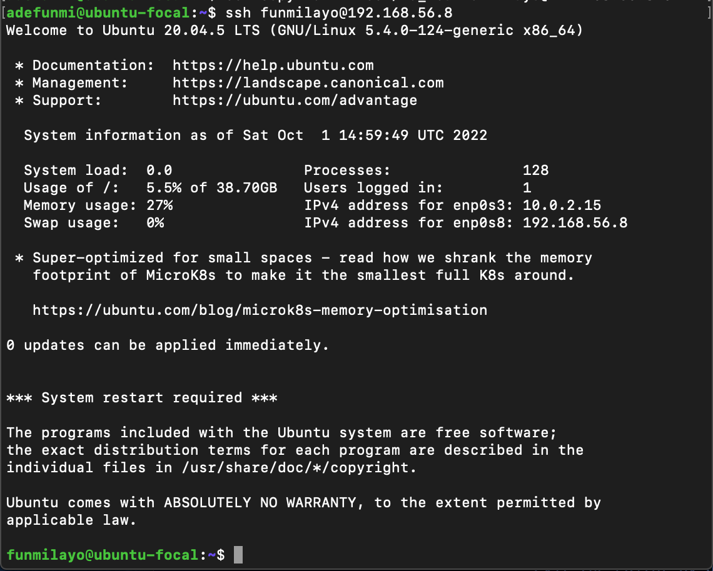

# How to solve ssh-copy-id Permission denied (public key) between two Ubuntu machines.

Are you trying to set up an ssh connection with a remote computer and when you tried to copy your public key with the `ssh-copy-id` command you met this brick-wall (Permission denied (public key))? Not to worry, I have documented a way I used in solving the issue.

If you are not sure of what I mean, the following image shows the error I am talking about.



<br>

### Requirements
1. Two linux machines, one will serve as a the host machine while the other will serve as the remote one.

<br>

2. Users on the machines: I created a user called `adefunmi` on the host machine and another one called `funmilayo` on the remote machine.

<br>

3. Generate an ssh key-pair with the user's account on the host machine with `ssh-keygen -t rsa`

<br>

### How to solve permission denied (public key) error.

1. On your second machine, Switch to your root user with `sudo su` command and create a new user with the `adduser username` command, in this example, my username is funmilayo.


<br>

2. After creating the user, switch into the new user's account with the `su username` command and change into the user's home directory with the `cd ~` command.
<br>

3. In the home directory, make a directory called `.ssh` with:

```
mkdir .ssh
```


Note that there was no `.ssh` directory when I initially listed the contents of the user's home directory.

<br>

4. Change into the `.ssh` directory to create and edit another file called `authorized_keys`.

```
cd .ssh
nano authorized_keys
```


<br>

5. Go to the machine with the ssh keys, copy the public key (.pub key) manually, and paste into the authorized_keys file you opened in `number 4` above.
Save the nano file by pressing `control o` and `enter` keys and exit the editor by pressing `control x` keys.

<br>

6. Restart the sshd service with the
`sudo systemctl restart sshd` command.

7. Finally, connect to your remote server from your host machine with `ssh user@remoteserver`. Note how I am using the command on the host machine's terminal.




## In conclusion

The above steps have shown you how to successfully create a secure connection between two ubuntu machines especially when faced with the permission denied (public key) error. I hope this article helps you get past that obstacle so that you can be able to create more magic in your terminal. 